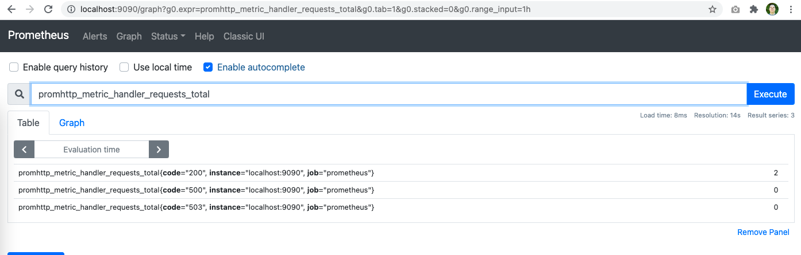
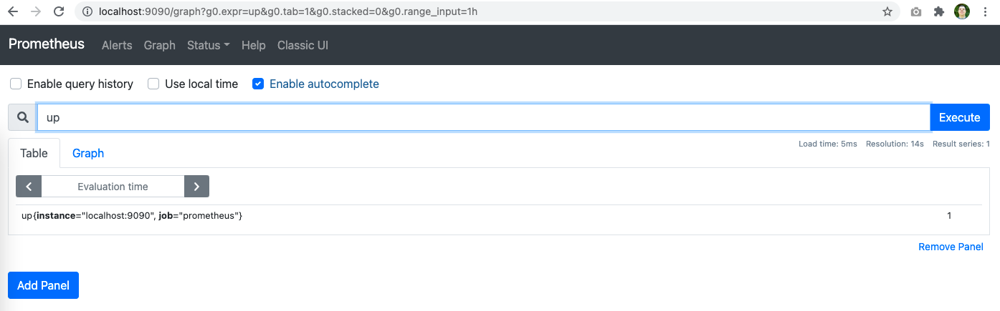

# Instalando o Prometheus no Linux

O processo de instalação do Prometheus é bastante simples, um único binário já tem tudo que é necessário para rodar uma instalação mais simples. Mas primeiro precisamos ter um sistema Linux funcionando, caso você já tenha um ótimo, pode pular esse passo inicial, caso ainda não tenha eu recomendo fortemente o uso do vagrant e do virtualbox, ambos softwares gratuitos que você pode usar para ter um Linux rápido e funcional no seu computador.

## Criando o ambiente

Download: [Vagrant](https://www.vagrantup.com/), [Virtualbox](https://www.virtualbox.org/)

A instalação dos dois softwares é bastante simples, basicamente download e depois next, next e finish. Depois dos dois softwares instalados, basta abrir um terminal e digitar os seguintes comandos:

```
vagrant init ubuntu/trusty64
vim Vagrantfile
```

Copiar o conteúdo do arquivo [Vagrantfile](vagrant/Vagrantfile), isso vai inicializar uma VM Ubuntu e já liberar as portas necessárias para podermos acessar as interfaces do Prometheus diretamente no nosso navegador.

Depois:
```
vagrant up
vagrant ssh
```

## Download do Prometheus

Agora você precisa entrar na página de [downloads](https://github.com/prometheus/prometheus/releases/) do Prometheus e pegar a última versão para o linux, atualmente é assim:

```
wget https://github.com/prometheus/prometheus/releases/download/v2.23.0/prometheus-2.23.0.linux-amd64.tar.gz
tar xvfz prometheus-*.tar.gz
cd prometheus-*
```

Para garantir que ele está funcionando corretamente, execute `prometheus --help` que vai exibir as informações de ajuda para iniciar o sistema:

```
./prometheus --help
```

Podemos iniciar o Prometheus utilizando o arquivo de configuração padrão que já vem com o pacote de instalação:

```
./prometheus --config.file=prometheus.yml
```

Algumas mensagens importantes aparecem na tela, como por exemplo que não configuramos um período de retenção e ele colocou no valor default de 15 dias. Aparecem ainda a versão do Prometheus, do Go, e ainda informações do host. `TSDB` é uma abreviação para Time Series Database.

Mais algumas informações como carregando arquivo de configuração, os tempos que ele demorou para fazer cada operação, e finalmente que o serviço foi iniciado.

Depois disso basta abrir o seu navegador local preferido em http://localhost:9090/ e já pode começar a navegar por algumas métricas, já que a configuração padrão faz com que o Prometheus já colete as métricas dele mesmo.

```
 promhttp_metric_handler_requests_total
 up
 go_threads
```






## Configurando do jeito certo

Bom, mas não podemos deixar o Prometheus rodando dessa forma, precisamos corrigir algumas questões de segurança e deixar o serviço do Prometheus executando em background, que ele inicialize com o sistema, etc.

Primeiro passo vamos criar um usuário próprio para o Prometheus, por uma questão de segurança é melhor que ele seja executado sobre seu próprio usuário sem permissões exageradas de um usuário root por exemplo:

```
sudo useradd --no-create-home --shell /bin/false prometheus
```

Vamos criar uma pasta para os dados e outra para as configurações do prometheus:

```
sudo mkdir /etc/prometheus
sudo mkdir /var/lib/prometheus
```

E vamos colocar as permissões necessárias para as pastas poderem ser acessadas pelo usuário que criamos do Prometheus:

```
sudo chown prometheus:prometheus /etc/prometheus
sudo chown prometheus:prometheus /var/lib/prometheus
```

Vamos copiar os binários para os locais corretos e colocar as permissões corretas:

```
sudo cp prometheus /usr/local/bin/
sudo cp promtool /usr/local/bin/

sudo chown prometheus:prometheus /usr/local/bin/prometheus
sudo chown prometheus:prometheus /usr/local/bin/promtool
```

Depois vamos copiar os diretórios `consoles` e o `console_libraries` para o `/etc/prometheus`

```
sudo cp -r consoles /etc/prometheus
sudo cp -r console_libraries /etc/prometheus

sudo chown -R prometheus:prometheus /etc/prometheus/consoles
sudo chown -R prometheus:prometheus /etc/prometheus/console_libraries
```

Vamos copiar também o arquivo de configuração do Prometheus:

```
sudo cp prometheus.yml /etc/prometheus/
sudo chown prometheus:prometheus /etc/prometheus/prometheus.yml
```

Agora vamos configurar o Prometheus para ser executado através do systemd.

```
sudo vim /etc/systemd/system/prometheus.service

[Unit]
Description=Prometheus
Wants=network-online.target
After=network-online.target

[Service]
User=prometheus
Group=prometheus
Type=simple
ExecReload=/bin/kill -HUP $MAINPID
ExecStart=/usr/local/bin/prometheus \
    --config.file /etc/prometheus/prometheus.yml \
    --storage.tsdb.path /var/lib/prometheus/ \
    --web.console.templates=/etc/prometheus/consoles \
    --web.console.libraries=/etc/prometheus/console_libraries

[Install]
WantedBy=multi-user.target
```

Depois só iniciar o sistema:

```
sudo apt-get install systemd
sudo systemctl daemon-reload
sudo systemctl start prometheus
sudo systemctl status prometheus
```

Depois vamos colocar para ele ser iniciado quando o servidor reiniciar.

```
sudo systemctl enable prometheus
```

Agora para ver os logs podemos ver assim:

```
sudo journalctl -u prometheus --since today
```

Bom, agora já temos o Prometheus rodando no nosso servidor Linux e monitorando a si mesmo. No próximo passo vamos ver como fazer o Prometheus funcionar no Docker.
