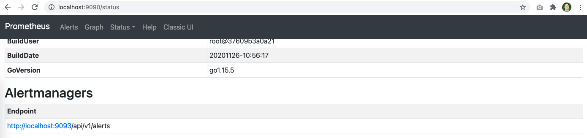

# Instalando o Alertmanager no Linux

Novamente o processo básico de instalação é bastante simples, apenas um binário com tudo que é necessário para executar o sistema.

Vamos para a pagina de [download](https://prometheus.io/download/#alertmanager) novamente.

E usando o mesmo servidor Linux que usamos para instalar o Prometheus vamos executar o seguinte:

```
wget https://github.com/prometheus/alertmanager/releases/download/v0.21.0/alertmanager-0.21.0.linux-amd64.tar.gz
tar -xvf alertmanager-0.21.0.linux-amd64.tar.gz
cd alertmanager-0.21.0.linux-amd64/
```

Para executar o Alertmanager executamos:

```
./alertmanager --config.file=alertmanager.yml
```

As mensagens simples como a versão, carregando as configurações, porta em que esta escutando e finalmente que o serviço esta apto para receber requisições.

Isso é a forma mais simples de executar o Alertmanager, mas vamos seguir um processo semelhante ao processo do Prometheus aqui.

## Instalando do jeito certo


Criamos um usuário próprio para executar o Alertmanager por questões de segurança e depois colocamos as permissões corretas, nos binários.

```
sudo useradd --no-create-home --shell /bin/false alertmanager
sudo mv alertmanager /usr/local/bin
sudo mv amtool /usr/local/bin

sudo chown alertmanager:alertmanager /usr/local/bin/alertmanager
sudo chown alertmanager:alertmanager /usr/local/bin/amtool
```

Depois disso criamos as pastas necessárias e copiamos o arquivo de configuração default.

```
sudo mkdir /etc/alertmanager
sudo cp alertmanager.yml /etc/alertmanager/alertmanager.yml
sudo chown -R alertmanager:alertmanager /etc/alertmanager
```

Agora vamos criar um serviço para ser inicializado pelo systemd.

```
sudo vim /etc/systemd/system/alertmanager.service

[Unit]
Description=Alertmanager
Wants=network-online.target
After=network-online.target

[Service]
User=alertmanager
Group=alertmanager
Type=simple
WorkingDirectory=/etc/alertmanager/
ExecReload=/bin/kill -HUP $MAINPID
ExecStart=/usr/local/bin/alertmanager --config.file=/etc/alertmanager/alertmanager.yml --web.external-url http://0.0.0.0:9093

[Install]
WantedBy=multi-user.target
```

Agora iniciamos o Alertmanager e colocamos ele para reiniciar com o servidor.

```
sudo systemctl daemon-reload
sudo systemctl start alertmanager
sudo systemctl status alertmanager
sudo systemctl enable alertmanager
```

Agora precisamos conectar o prometheus ao Alertamanger.

```
sudo vim /etc/prometheus/prometheus.yml

...
# Alertmanager configuration
alerting:
  alertmanagers:
  - static_configs:
    - targets:
      - localhost:9093
...
```

Agora reiniciamos o prometheus e verificamos os status:

```
sudo systemctl reload prometheus
sudo systemctl status prometheus
```

Podemos ver no pagina do Prometheus a url do alertmanager ja apontando para a nova instancia.


