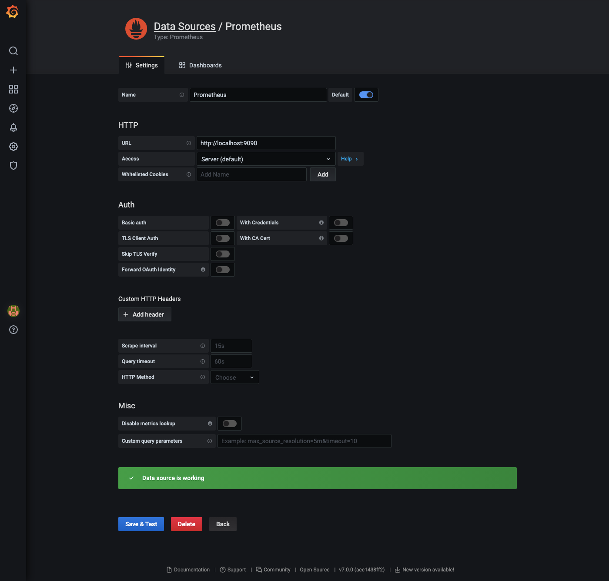
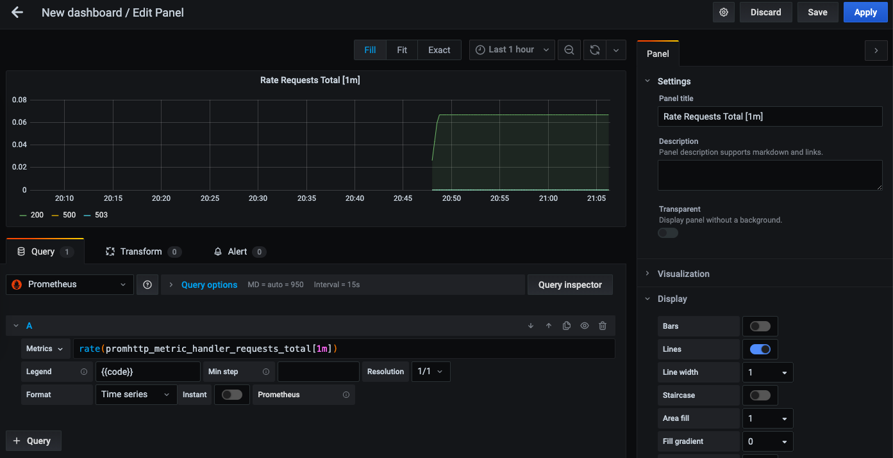

# Instalando o Grafana no Linux

O grafana é onde vamos visualizar as métricas, criar graficos e dashboards das metricas que coletamos no prometheus. É uma ferramenta muito importante e geralmente são usados em conjunto.

Vamos voltar ao nosso servidor, que é um Ubuntu, mas na documentação do Grafana tem instruções sobre como instalar ele em diversos outros sistemas. https://grafana.com/docs/grafana/latest/installation/

```
sudo apt-get install -y apt-transport-https
sudo apt-get install -y software-properties-common wget
wget -q -O - https://packages.grafana.com/gpg.key | sudo apt-key add -
echo "deb https://packages.grafana.com/enterprise/deb stable main" | sudo tee -a /etc/apt/sources.list.d/grafana.list
```

Agora que o repositio esta configurado, vamos instalar o grafana.

```
sudo apt-get update
sudo apt-get install grafana
```

Agora iniciamos ele e configuramos para iniciar junto com o sistema.

```
sudo service grafana-server start
sudo service grafana-server status
sudo update-rc.d grafana-server defaults
```

## Configurando o Grafana

Vamos criar um data source e criar um primeiro grafico, entre na url: http://localhost:3000/

Usuario e senha default, depois disso você pode trocar.

* user: admin
* pass: admin


Primeiro precisamos criar o datasource do prometheus, va em `Configurações -> Data Source -> Add data source`.



Depois vamos criar o primeiro grafico, va em `Create -> Dashboard.`

```
rate(promhttp_metric_handler_requests_total[1m])
```


