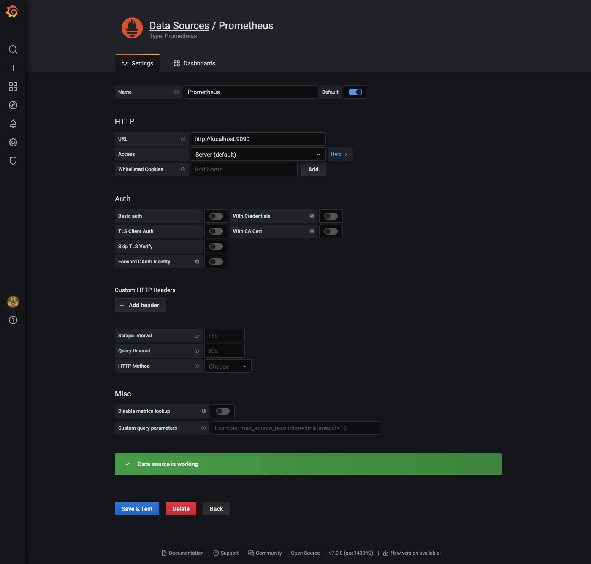
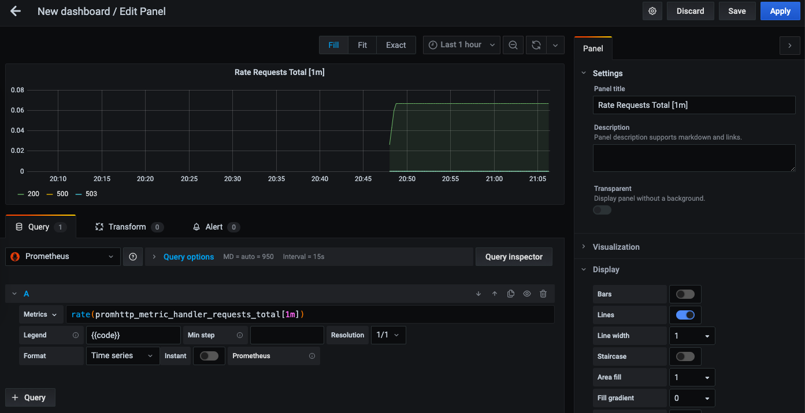

# Instalando o Grafana no Linux

O grafana é onde vamos visualizar as métricas, criar graficos e dashboards das metricas que coletamos no prometheus. É uma ferramenta muito importante e geralmente são usados em conjunto.

Vamos voltar ao nosso servidor, que é um Ubuntu, mas na documentação do Grafana tem instruções sobre como instalar ele em diversos outros sistemas. https://grafana.com/docs/grafana/latest/setup-grafana/installation/

O jeito de adicionar a chave do repositório mudou nas versões mais novas do Ubuntu, o velho `apt-key` foi aposentado e agora a chave fica em um arquivo próprio dentro de `/etc/apt/keyrings`:

```
sudo apt-get install -y apt-transport-https software-properties-common wget gnupg

sudo mkdir -p /etc/apt/keyrings
sudo wget -q -O /etc/apt/keyrings/grafana.asc https://apt.grafana.com/gpg-full.key
sudo chmod 644 /etc/apt/keyrings/grafana.asc

echo "deb [signed-by=/etc/apt/keyrings/grafana.asc] https://apt.grafana.com stable main" | sudo tee -a /etc/apt/sources.list.d/grafana.list
```

Agora que o repositório esta configurado, vamos instalar o grafana.

```
sudo apt-get update
sudo apt-get install grafana
```

Agora iniciamos ele e configuramos para iniciar junto com o sistema.

```
sudo systemctl daemon-reload
sudo systemctl start grafana-server
sudo systemctl status grafana-server
sudo systemctl enable grafana-server
```

## Configurando o Grafana

Vamos criar um data source e criar um primeiro grafico, entre na url: http://localhost:3000/

Usuario e senha default, depois disso você pode trocar.

* user: admin
* pass: admin


Primeiro precisamos criar o datasource do prometheus, va em `Connections -> Data sources -> Add new data source` e escolha o Prometheus. O menu mudou de lugar algumas vezes nas versões mais novas do Grafana, mas a ideia continua a mesma: você aponta a url do Prometheus, que no nosso caso é `http://localhost:9090`, e salva.



Depois vamos criar o primeiro grafico, va em `Dashboards -> New -> New dashboard -> Add visualization` e escolha o datasource que acabamos de criar.

```
rate(promhttp_metric_handler_requests_total[1m])
```


