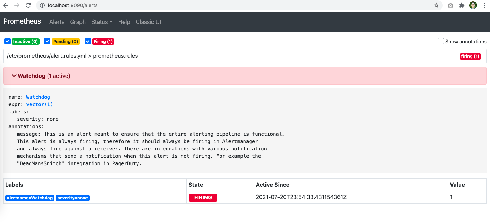
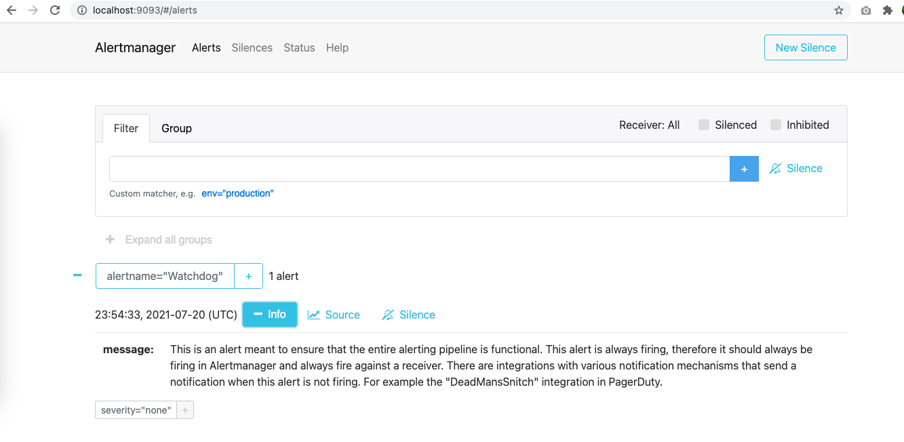

# Criando seu primeiro alerta

Vamos criar um alerta que sempre alarme para testar se tudo funcionou.

Primeiro temos que configurar o Prometheus para ler nosso arquivo de configuração com o alertas que queremos criar. Dentro do prometheus você pode ter varios rules_files, pode dividir eles como achar mais adequado, por exemplo por serviço, plataforma ou separar os alertas das persistentes rules.

```
sudo vim /etc/prometheus/prometheus.yml

rule_files:
   - "alert.rules.yml"

```

Depois vamos criar a nossa regra:

```
sudo vim /etc/prometheus/alert.rules.yml

groups:
- name: prometheus.rules
  rules:
  - alert: Watchdog
    annotations:
      message: |
        This is an alert meant to ensure that the entire alerting pipeline is functional.
        This alert is always firing, therefore it should always be firing in Alertmanager
        and always fire against a receiver. There are integrations with various notification
        mechanisms that send a notification when this alert is not firing. For example the
        "DeadMansSnitch" integration in PagerDuty.
    expr: vector(1)
    labels:
      severity: none
```

Utilizando o `promtool` podemos verificar se as Verificando se as regras estão corretas:

```
sudo promtool check rules /etc/prometheus/alert.rules.yml
Checking /etc/prometheus/alert.rules.yml
  SUCCESS: 1 rules found
```

Precisamos reiniciar o Prometheus, para reler as confs.

```
sudo systemctl reload prometheus
```

Agora podemos ver na pagina do alertmanager o alerta acontecendo. Podemos inclusive criar um silence para ele para teste.




