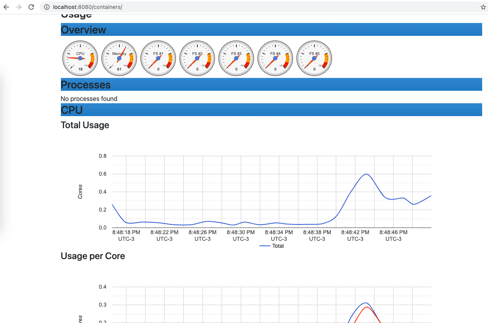

# Cadvisor

Com o aumento dos microserviços, usos de containers, Kubernetes e docker é necessário também poder monitorar as métricas dos containers e entender o funcionamento deles. O Google desenvolveu o cadvisor, um container que consegue coletar estatísticas e métricas de outros containers.

Vamos usar ele na nossa maquina local nesse primeiro momento, no módulo sobre Kubernetes vamos falar mais sobre ele em um cluster.

```
docker run \
  --volume=/:/rootfs:ro \
  --volume=/var/run:/var/run:ro \
  --volume=/sys:/sys:ro \
  --volume=/var/lib/docker/:/var/lib/docker:ro \
  --volume=/dev/disk/:/dev/disk:ro \
  --publish=8080:8080 \
  --detach=true \
  --name=cadvisor \
  --privileged \
  --device=/dev/kmsg \
  gcr.io/cadvisor/cadvisor:v0.55.1
```

Duas observações sobre essa versão. A primeira: o release do cAdvisor no GitHub já está mais à frente, mas a imagem publicada em `gcr.io` para na `v0.55.1` — se você pinar pela versão do release, o `docker pull` falha. A segunda: esse `--volume=/var/lib/docker/:/var/lib/docker:ro` só funciona se o Docker rodar num Linux de verdade. No Docker Desktop do macOS esse diretório mora dentro da VM, não no seu disco, e o cAdvisor sobe sem enxergar container nenhum. Com [colima](https://github.com/abiosoft/colima) funciona, porque o bind é resolvido dentro da própria VM.

Depois de termos o container executando conseguimos acessar um dashboard bastante interessante dele através de `locahost:8080`. Nele temos informações gerais do sistema e também dos containers em execução.



Vamos subir mais um container para poder verificar entre os containers as informações:

```
docker run --name blackbox -p 9115:9115 prom/blackbox-exporter:v0.28.0
```


Depois disso a integração com o prometheus tbm é simples:

```
scrape_configs:
  - job_name: 'cadvisor'
    static_configs:
      - targets: ['cadvisor:8080']
```
