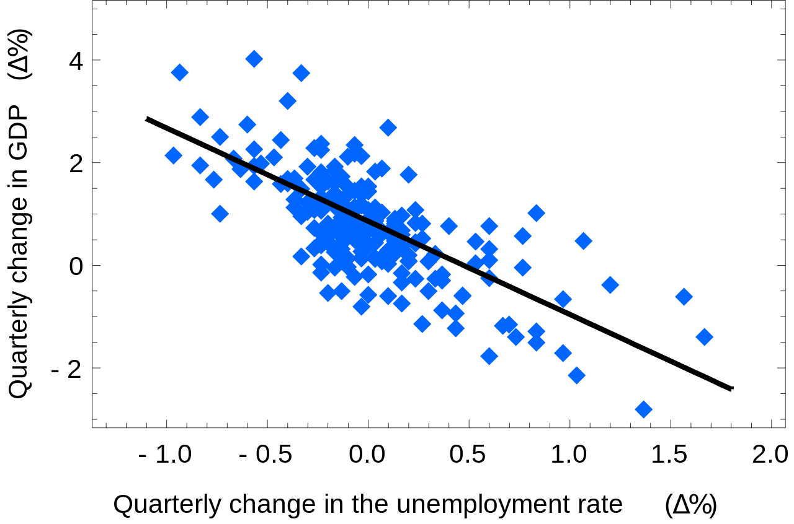

# Prevendo o Futuro

Os alertas que vimos até agora falam do estado atual das aplicações ou dos servidores. Se resumiam a alertar baseados no momento presente, mas pode ser interessante gerar alertas prevendo o futuro de uma aplicação, ou seja, se ela continuar se comportando assim, ou gerando essas métricas desse jeito em algum período de tempo no futuro isso vai ser um problema e eu gostaria de ser avisado agora, e não quando o problema estiver acontecendo.

Esse método também tende a tirar falsos positivos, ou alertas que fazemos muito cedo para não alarmar somente quando o cliente ja é afetado. Por exemplo, um alerta de uso de disco, vamos manter o threshold em 80% para termos tempo de agir caso o disco fique cheio, mas pode ter alguma rotina que faça o disco passar de 80% e volte ao normal logo depois e isso gere um numero grandes de falsos positivos e descredito nos alertas. Mas se eu puder prever que com esse comportamento em 4h o disco vai estar com 98% de uso e posso agir agora seria o ideal.

Para isso existe o predict_linear, ele usa o regressão linear simples para tentar prever o futuro. Em termos muito simples ele tenta traçar uma linha reta entre os padrões de dados em um período de tempo. Quando os valores são normalmente distribuídos, ou seja, seguem um padrão é um método bastante eficiente.



Por exemplo, podemos criar a seguinte expressão:

```
expr: predict_linear(node_filesystem_avail_bytes[1h], 4 * 3600) < 0
```

Com isso vamos analisar a ultima 1 hora da métrica `node_filesystem_avail_bytes` e tentar prever as próximas 4 horas (4 vezes 3600 segundos), se isso for menor que zero significa que não teremos mais espaço em disco disponível e podemos trabalhar agora para tentar resolver o problema.

Cuidado para não confundir duas métricas parecidas do node_exporter: `node_filesystem_avail_bytes` é **espaço livre em bytes**, e `node_filesystem_files_free` é **inode livre**. São problemas diferentes — dá para encher os inodes com o disco praticamente vazio, se a aplicação criar muito arquivo pequeno. Se é do inode que você quer cuidar, a expressão é a mesma, só trocando a métrica.

Vale filtrar os sistemas de arquivo virtuais, senão o alerta dispara por causa de `tmpfs` e afins:

```
expr: predict_linear(node_filesystem_avail_bytes{fstype!~"tmpfs|overlay"}[1h], 4 * 3600) < 0
```
