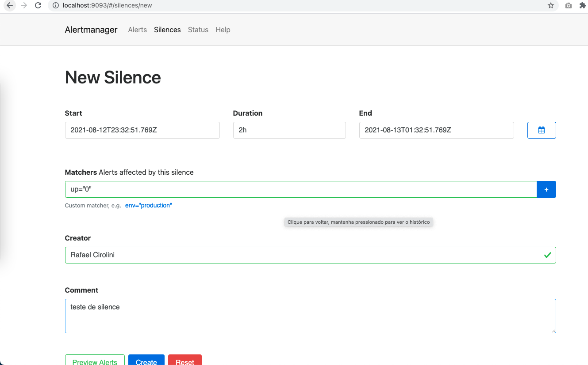
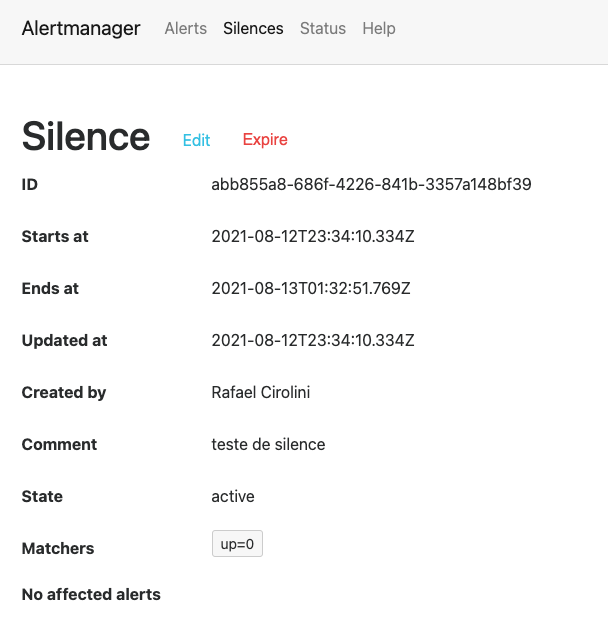
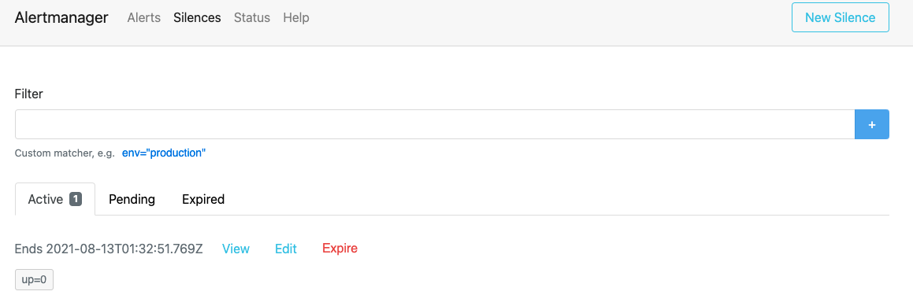

# Silenciando Alertas

Uma parte importante de todo sistema de monitoração é a habilidade de suprimir, nos termos do prometheus, silenciar alertas por um período de tempo. Isso é util em muitos modos, tanto para alertas que estão acontecendo e vão precisar de muito tempo para serem resolvidos, mas também para quando vamos entrar em alguma manutenção e queremos deixar uma plataforma inteira em manutenção.

Para silenciar os alertas podermos ir diretamente pela interface do Alertmanager, clicar em silences e podemos criar novos silences.







> ⚠️ **Screenshots para refazer.** Interface do Alertmanager 0.21; hoje estamos na 0.34.

Quando não quiser mais o silence ativo, pode clicar no botão de expirar. Ou simplesmente esperar o tempo de silence que colocou para ele acabar.

## Pela linha de comando

Clicar na interface é ótimo para um silence pontual, mas quando a manutenção é programada você provavelmente quer isso dentro de um script. O `amtool`, que vem junto com o Alertmanager, faz o mesmo:

```
# silencia por 2 horas tudo que for da instance abaixo
amtool silence add instance=servidor01 --duration=2h   --comment="manutencao programada"   --alertmanager.url=http://localhost:9093

# lista o que esta silenciado agora
amtool silence query --alertmanager.url=http://localhost:9093

# expira um silence antes da hora
amtool silence expire <id> --alertmanager.url=http://localhost:9093
```

Colocar o `silence add` no começo do script de deploy e o `expire` no fim é um jeito barato de não acordar ninguém por causa de manutenção.
