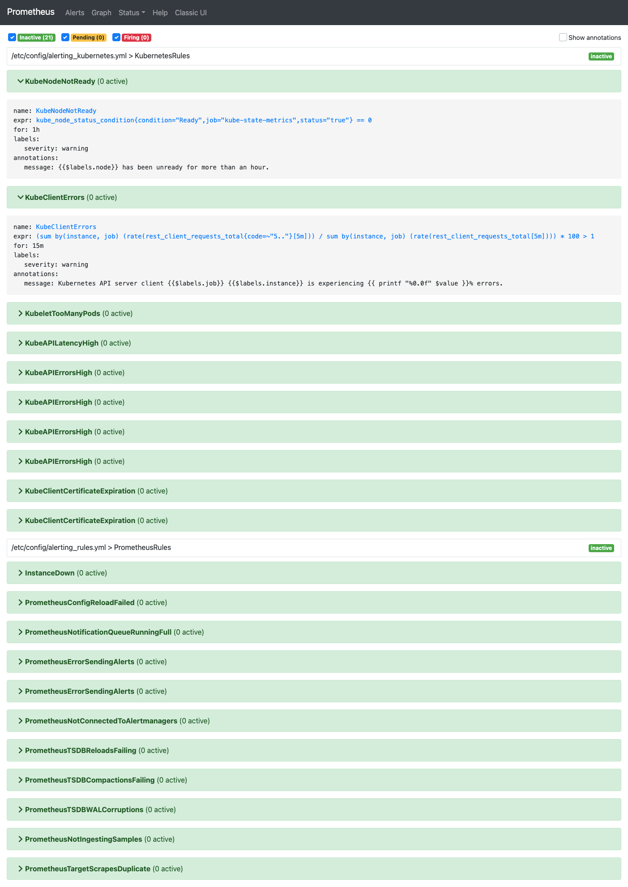

# Alertando no Kubernetes

Precisamos também criar as monitorações no prometheus. Recomendo que se vc tem um time trabalhando nos alertas que esse processo fique em algum tipo de sistema de controle de versão como o github ou gitlab, e melhor ainda seria integrar um sistema automatizado para atualizar a partir de alterações.

Com o Prometheus Operator isso fica natural, porque o alerta deixa de ser um trecho de arquivo de configuração e vira um objeto do Kubernetes: o **PrometheusRule**.

> **O que mudou nesta edição.** A versão antiga deste capítulo mandava passar arquivos de alerta como `serverFiles` no `helm upgrade`. Aquilo não funciona mais aqui — e, diga-se, o `alerting-codex.yml` da edição antiga nunca funcionou direito: ele usava as variáveis `{{ $prometheusJob }}` e `{{ $namespace }}`, que não existiam em lugar nenhum do chart, então o `helm upgrade` falhava com "undefined variable". Os arquivos continuam em [`legacy/`](legacy/) para consulta.

## O que já vem pronto

Antes de escrever alerta, vale ver o que você já tem:

```
kubectl -n monitoring get prometheusrule
```

São dezenas. O kube-prometheus-stack instala os alertas do [kubernetes-mixin](https://github.com/kubernetes-monitoring/kubernetes-mixin), que cobrem o básico bem feito: pod em CrashLoop, node com disco enchendo, deployment que não completa, certificado do apiserver vencendo. Leia antes de escrever o seu — boa chance de já existir.

Para ver o conteúdo de um:

```
kubectl -n monitoring get prometheusrule monitoring-kubernetes-apps -o yaml
```

## Criando o seu alerta

Um `PrometheusRule` é um manifesto comum. O que vai dentro de `groups` é exatamente o mesmo YAML que você escreveria no `rule_files` do Prometheus no Linux — o que muda é o invólucro:

```yaml
apiVersion: monitoring.coreos.com/v1
kind: PrometheusRule
metadata:
  name: curso-rules
  namespace: monitoring
  labels:
    release: monitoring        # importante, veja abaixo
spec:
  groups:
    - name: curso.rules
      rules:
        - alert: PodCrashLooping
          expr: increase(kube_pod_container_status_restarts_total[10m]) > 3
          for: 5m
          labels:
            severity: warning
          annotations:
            summary: 'Pod {{ $labels.namespace }}/{{ $labels.pod }} reiniciando demais'
            description: 'Mais de 3 restarts em 10 minutos.'

        - alert: NodeFilesystemPredictedFull
          expr: predict_linear(node_filesystem_avail_bytes{fstype!~"tmpfs|overlay"}[1h], 4 * 3600) < 0
          for: 15m
          labels:
            severity: warning
          annotations:
            summary: 'Disco de {{ $labels.instance }} deve encher em 4h'
            description: 'Projecao por regressao linear sobre a ultima hora.'
```

Repare que o `predict_linear` do módulo 06 atravessou o curso inteiro e chegou aqui sem mudar uma vírgula. A PromQL é a mesma em todo lugar; o que muda é onde a expressão mora.

Aplicando:

```
kubectl apply -f curso-rules.yaml
```

**E é só isso.** Não tem reload, não tem `helm upgrade`, não tem reiniciar pod. O operator percebe o objeto novo, regenera a configuração e recarrega o Prometheus sozinho. Em alguns segundos a regra está valendo.

### O label `release`

Aquele `labels: release: monitoring` não é decoração. Por padrão o operator só carrega `PrometheusRule` que tenha o label do release do helm — é uma proteção para um objeto perdido em outro namespace não entrar na sua monitoração sem ninguém ver.

Se a sua regra não aparecer, é quase sempre isso. Para conferir o que o operator está procurando:

```
kubectl -n monitoring get prometheus monitoring-prometheus \
  -o jsonpath='{.spec.ruleSelector}' ; echo
```

No values do lab desligamos esse filtro com `ruleSelectorNilUsesHelmValues: false`, então lá qualquer regra é aceita.

## Pelo helm, em vez do kubectl

Se você prefere manter tudo no values, o chart aceita:

```yaml
additionalPrometheusRulesMap:
  curso-rules:
    groups:
      - name: curso.rules
        rules:
          - alert: PodCrashLooping
            expr: increase(kube_pod_container_status_restarts_total[10m]) > 3
            ...
```

É o que o [values do lab](../labs/k8s/kube-prometheus-stack-values.yaml) faz. Escolha um dos dois caminhos e fique nele — misturar rende alerta duplicado.

## Conferindo

Antes de aplicar, valide a expressão como faria em qualquer lugar:

```
promtool check rules curso-rules.yaml
```

Depois de aplicar, confirme que o Prometheus carregou de verdade:

```
kubectl -n monitoring port-forward svc/monitoring-prometheus 9090:9090
```

E abra a aba `Alerts`, ou consulte pela API:

```
curl -s localhost:9090/api/v1/rules | jq '.data.groups[] | select(.name=="curso.rules")'
```



> ⚠️ **Screenshot para refazer.** A imagem é da interface do Prometheus 2. A UI foi reescrita na versão 3.

## Notificações

O Alertmanager também ganhou um objeto próprio, o `AlertmanagerConfig`, que permite a cada time configurar as próprias rotas sem mexer na configuração central. Para o lab, configurar pelo values é mais simples — e a sintaxe de rotas e receivers é idêntica à do módulo 06, `matchers` inclusive.
