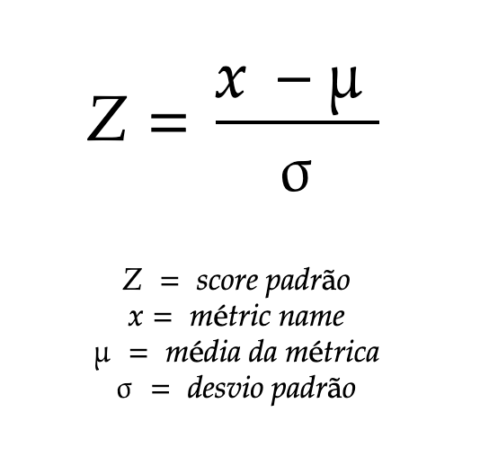
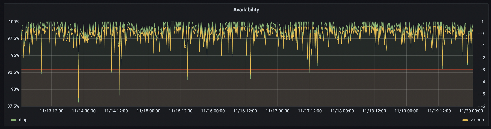

# Detecção de Anomalia com Z-Score

Um tópico bastante interessante em qualquer universo dos dados é os modelos de detecção de anomalias. O Z-Score, ou Escore padrão, ou standard score é um método simples para encontrar desvios padrão em series de dados, basicamente encontrar anomalias em dados do tipo timeseries.

O primeiro aviso, o z-score funciona muito bem com dados com uma distribuição normal. Dados que sofrem muita sazonalidade, diminuem muito a noite, ou que variam muito ele pode ter dificuldade e conter muitos falsos positivos.

Um valor que eu gosto bastante de usar o z-score é para detecção de anomalia em tempos de entrega, e também para dados de disponibilidade, como são dados que tem menos variações, o z-score costuma ser bem preciso.

A formula do z-score é assim:



## Como calcular o z-score

Para calcular o z-score você precisa subtrair a métrica pela média da métrica e dividir o resultado pelo desvio padrão. Como estamos lidando com um timeseries, vamos pegar a média sobre o tempo e o desvio padrão sobre o tempo da ultima semana, para ter um valor com uma média mais precisa porque vamos observar um tempo maior.

A formula no Prometheus fica assim, algo bem fácil de fazer no Prometheus.

```
(
  http_availability -
  avg_over_time(http_availability[1w])
) / stddev_over_time(http_availability[1w])
```

O resultado é um valor que vai dizer o quanto longe do normal que a métrica esta, sendo que um valor igual a 0 significa que esta exatamente no valor normal e um +3 ou -3 esta muito acima ou abaixo do normal.

Se colocarmos isso em um gráfico vai ficar assim, e cada vez que o valor do z-score baixou de -3 foi algo realmente muito baixo do normal.



Para criarmos um alerta pode ser algo nessa linha:

```
- name: AnomalyDetection
  rules:
  - alert: HTTPAvailabilityAnomalyDetection
    expr: (( http_availability - avg_over_time(http_availability[1w])) / stddev_over_time(http_availability[1w]) ) < -3
    for: 15m
    labels:
      severity: warning
    annotations:
      summary: "Anomalia detectada na disponibilidade HTTP"
      description: "O z-score caiu abaixo de -3, ou seja, mais de 3 desvios padrao abaixo do normal da ultima semana."
```

Atenção ao sinal: é `< -3`, não `< 3`. Com `< 3` o alerta dispararia praticamente o tempo todo, já que quase todo valor normal fica abaixo de 3 desvios padrão. O que queremos é o outro extremo — o valor que está **muito abaixo** do normal.


Referencias:
- https://about.gitlab.com/blog/2019/07/23/anomaly-detection-using-prometheus/
- https://en.wikipedia.org/wiki/Standard_score
